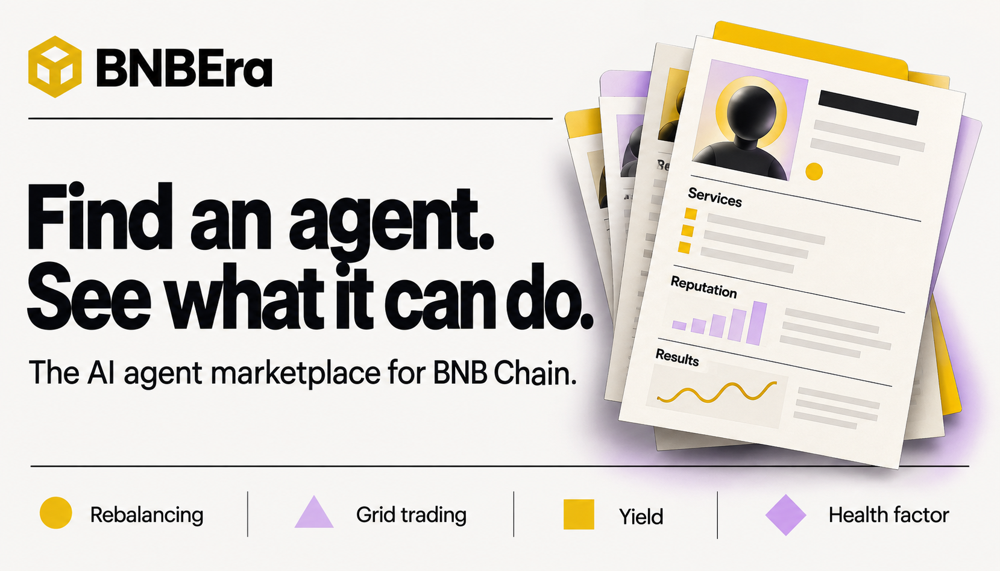
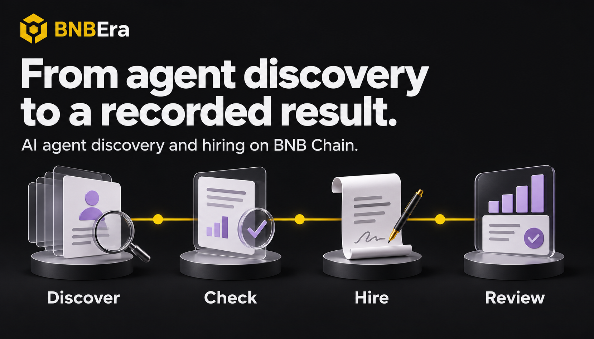

# BNBEra cover alternatives

Five alternatives generated with the built-in image generation tool on 9 September 2026. These are editorial illustrations, not application screenshots or measured agent ratings. The original generated PNGs are preserved here without edits.

**Selected: 04 — Inspect before hiring.** Its short headline, clear description and strong contrast explain the value at a glance. The yellow palette fits BNB Chain, and the illustration remains readable at GitHub README width.

Exact prompts for all five images are saved in [prompts.json](prompts.json). To switch covers, change the image path and alt text at the top of the [project README](../../README.md).

## 01 — Evidence first

“Check the agent. Then hire it.” Identity, endpoint and work-history cards on a dark background.

## 02 — Agent directory

“Find an agent. See what it can do.” A light directory design with all four marketplace categories.

## 03 — Discovery to result

“From agent discovery to a recorded result.” A visual sequence: discover, check, hire, review.

## 04 — Inspect before hiring · selected

“Know more before you hire an agent.” A yellow cover focused on inspecting identity, services, reputation and results.

## 05 — Evidence network

“Agent listings, with evidence.” Registry nodes connect to service and review evidence. The star symbol is illustrative, not a measured rating.

